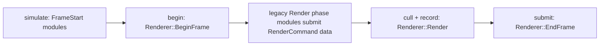

# Minimal Frame Task Graph

This is the first low-risk frame graph for WraithEngine. The existing
`ModuleManager` phase walk remains authoritative for modules that have not been
ported. The renderer frame module is the only ported module.

## Current Stages

`BeginFrame` is scheduled through `Jobs::ScheduleJob` and then waited at the end
of `RenderBegin`, because render-command producers still run later in the
regular `Render` phase and require an open `RenderScene`.

`Renderer::Render` is scheduled after the begin job. It owns the Vulkan scene
preparation work, including the guarded parallel CPU cull path. `Renderer::EndFrame`
is scheduled with `Jobs::ScheduleJobAfter` after render and waited before
`Application::Step` returns.

## Determinism Rules

- CPU cull resolves mesh handles serially into an immutable per-frame snapshot.
- Parallel cull workers write only to range-local candidate buckets.
- Buckets are merged in ascending input-range order before the existing sort and
  visible-list classification.
- `AXIOM_VERIFY_PARALLEL_CULL=ON` reruns the serial cull builder and asserts
  that candidate lists and frustum-cull counts match before downstream work.

## Config Flags

- `AXIOM_PARALLEL_CULL`: enables the Vulkan parallel CPU cull path.
- `AXIOM_VERIFY_PARALLEL_CULL`: compares parallel cull output against serial
  output.
- `AXIOM_FRAME_TASK_GRAPH`: enables the renderer frame module job chain.

Each flag is also exposed through `ApplicationConfig` / `RendererCreateInfo` so
tests and hosts can force a specific mode without changing global build flags.

## Next Ports

Future ports should move command-producing modules onto explicit producer tasks
instead of relying on `RenderCommand` global scene state. Once those producers
return immutable render packets, `BeginFrame` no longer needs to be synchronized
before the `Render` phase, and the graph can express true
`simulate -> cull(parallel) -> record -> submit` overlap.
