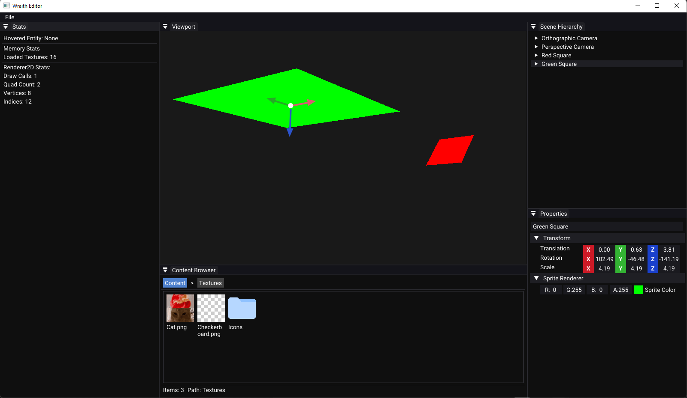
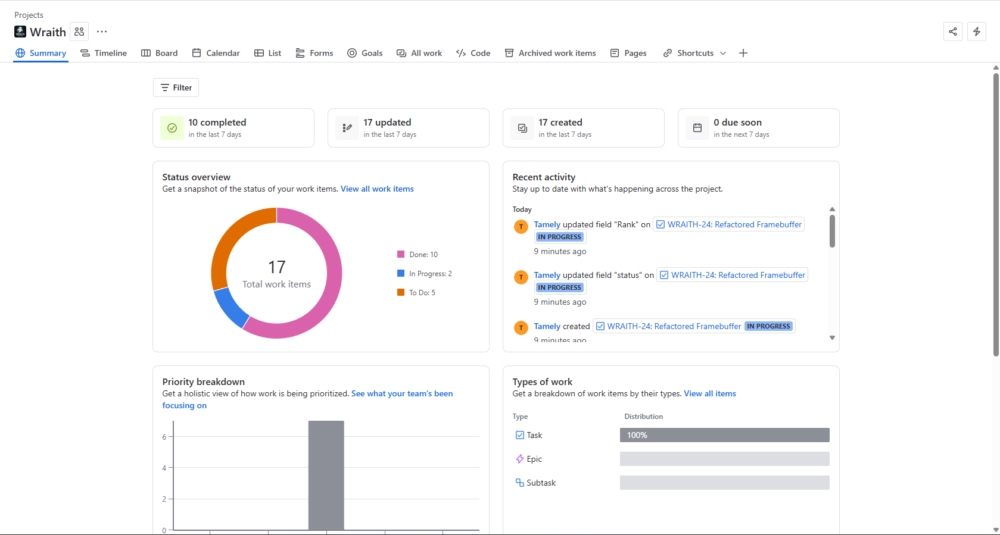

# Wraith Engine


Wraith Engine is a C++ / OpenGL–based game engine inspired by **Unreal Engine**, **Hazel**, and concepts from mathematics and physics resources. The project is built with **C++**, uses **OpenGL** for rendering (with future plans for Vulkan), and leverages **Premake** for build automation.

---

## Current Features

### Editor & Camera

* Editor camera with movement (`W`, `A`, `S`, `D`, `Space`, `Left Shift`), panning (Middle Mouse), rotation (Right Mouse), and zoom (Scroll Wheel).
* Mouse picking for selecting entities directly in the viewport.

### Rendering & Graphics

* OpenGL rendering pipeline with multiple render targets.
* Shaders updated to **SPIR-V**.
* Real-time scene rendering with dynamic lighting and basic shading.
* 2D texture support and gizmos for transformations.

### Scene & Entity Management

* Component-based entity system (ECS).
* Dynamic creation and deletion of entities.
* Scene serialization and deserialization for persistence.

### Engine Architecture

* Modular engine core separated from the editor.
* Public **Wraith API** for game development.
* Native scripting support.
* Organized folder structure with Premake build automation.

### User Interface

* Integrated editor UI with **ImGui**.
* Scene hierarchy and inspector panels.
* New **Content Browser** for managing assets.

### Project Management

* Development tracked with **Kanban methodology** in JIRA.
* Clear workflow for ongoing tasks and milestones.

---

## Current State of the Engine



---

## Roadmap

Wraith Engine is still in early development, but the focus is on building a solid foundation first before layering in advanced features. Here’s a breakdown of what’s coming next:

### Short-Term Goals (Next 1–2 Months)

* Vulkan backend implementation.
* Basic 3D mesh support (models and simple animations).
* Prefabs for reusable entity setups.
* Asset importer for textures and models.

### Mid-Term Goals (2–6 Months)

* Advanced rendering features: PBR, HDR, shadows, and post-processing (bloom, SSAO, tone mapping).
* Physics integration with rigidbodies, collisions, and triggers.
* Particle system for effects.
* Sound engine integration (with spatial audio).

### Long-Term Goals (6+ Months)

* Networking support: client/server model, multiplayer sync, and entity replication.
* Cross-platform builds (Linux/macOS) with potential for console support.
* In-editor debugging tools and hot-reloading.
* Expanded gameplay systems and scripting.

---

## Building Wraith Engine

### Prerequisites

* [Git](https://git-scm.com/) or [GitHub Desktop](https://desktop.github.com/)
* [Visual Studio 2022](https://visualstudio.microsoft.com/) (v17.8+ recommended, Community Edition supported)

### Steps

1. Clone the repository:

   ```bash
   git clone https://github.com/Tamely/WraithEngine.git
   ```

   Or download as `.zip` and extract (be sure to **Unblock** on Windows before extracting).

2. Run the setup script:

   * Navigate to `Scripts/` and run `Setup.bat`.
   * Installs dependencies and generates Visual Studio solution files.

3. Open `WraithEngine.sln` in Visual Studio.

   * Set configuration to `Dist` and platform to `x64`.

4. Build the editor:

   * Right-click **Wraith-Editor** → **Build**.

5. Run the engine:

   * Set **Wraith-Editor** as the startup project.
   * Press `F5` to launch.

---

## Project Management

Wraith Engine is actively maintained using **Kanban methodology** in **JIRA**, ensuring a structured workflow and clear task tracking.


