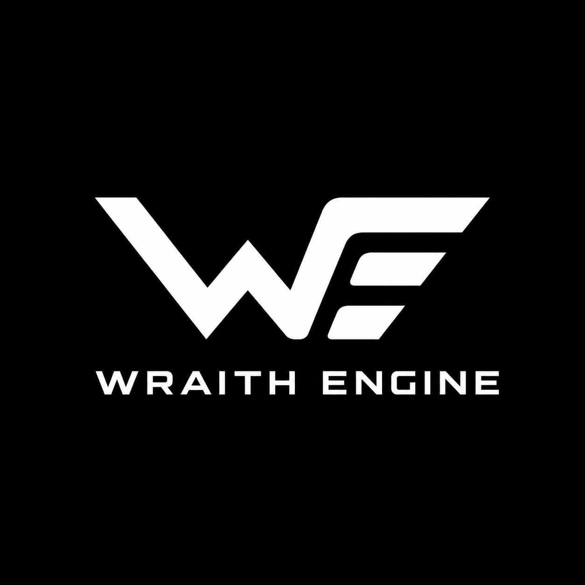
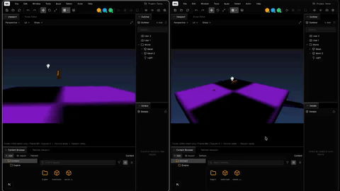

<div align="center">
  
  <h1>Wraith Engine</h1>
  <p>A distributed game engine with a browser-based collaborative editor</p>
</div>

---



## Overview

Wraith Engine is a C++/Vulkan game engine runtime paired with a browser-based editor shell. The engine runs headless on a server, streams rendered viewports to browser clients via WebRTC with H.264, and processes editing commands through an authoritative command/event model. One shared runtime supports both local native editing and remotely hosted collaborative sessions.

Collaborative simulation is session-wide: when the simulation host presses `Play`, `Pause`, or `Stop`, every connected collaborator sees the same runtime state. In the current model, the first connected browser collaborator becomes the simulation host for that session, while the headless renderer keeps its reserved local render user.

## Architecture

```
Browser (React / Next.js)
  ├─ Editor UI  (outliner, inspector, toolbar, content browser)
  └─ WebRTC Viewport Client
          ↕  commands  /  H.264 video
AxiomRemoteViewportServer  (C++)
  └─ EditorSession  (authoritative scene state)
          ├─ Vulkan Renderer  (offscreen, per-client)
          └─ ScriptHost  (Coral .NET 9 / C# scripting)
```

## Features

**Engine**
- Vulkan rendering backend with MoltenVK on macOS
- Headless offscreen rendering with H.264 encoding (VideoToolbox on macOS)
- Authoritative command/event model for scene mutations
- DataModel scene hierarchy — folders, meshes, lights, cameras, actors
- Transform gizmos (translate / scale / rotate) with server-side hit-testing
- Multi-client rendering: each connected user gets their own viewport
- WebRTC streaming to browser
- C# scripting via [Coral](https://github.com/StudioCherno/Coral) (.NET 9, hot reload, two trust tiers)
- Scene persistence — `scene.json` save/load across restarts
- Session-wide Play / Pause / Stop with authoritative edit-snapshot restore
- Runtime-only Jolt physics stepping with pause / resume support
- Default static box collision for imported mesh assets, with load-time migration for older meshes that had no authored physics yet
- Configurable sky background — a two-color vertical gradient (compute-shader blended) or an equirectangular HDR (`.hdr`) sampled from a world-space ray; HDR data is preserved end-to-end as float pixels through a v2 cooked `.wtex` so future image-based lighting can reuse the same asset

**Browser editor**
- Dockable panels: outliner, details/property inspector, content browser, toolbar
- Scene outliner with drag-drop reparenting, inline rename, right-click context menus
- Object lifecycle: create, duplicate, delete
- Per-client gizmo mode (Q / E / R shortcuts)
- Drag meshes into the remote viewport to add them directly
- Light icons render as color-tinted billboards and are selectable from the remote viewport
- User presence and camera visualization
- Script class attachment and hot-reload button
- Inspector-driven physics authoring: body type, collider type, extents/radius, mass, friction, bounce
- Read-only physics visibility for generated mesh children, with inheritance hints pointing back to the authored root mesh object
- World Details panel for editing the skybox: color pickers for the gradient mode, plus an HDR file slot that accepts drag-drop from the content browser, a searchable folder-icon picker listing every `.hdr` in the project, or a typed content-relative path

## Prerequisites

- CMake 3.10+
- Ninja (recommended; `brew install ninja`)
- C++20 compiler (Clang recommended; Apple Clang 15+ on macOS)
- Vulkan SDK / MoltenVK (macOS: `brew install --cask vulkan-sdk`)
- Node.js 18+ and [pnpm](https://pnpm.io)
- macOS: Xcode command-line tools (required for VideoToolbox / WebRTC)

**Optional, required only when the corresponding CMake flag is ON:**

| Feature | Requirement |
|---------|-------------|
| C# Scripting (`AXIOM_ENABLE_SCRIPTING`) | .NET 9 SDK (`brew install dotnet`) |
| WebRTC transport (`AXIOM_ENABLE_WEBRTC`) | Pre-built `WebRTC.framework` or `libwebrtc` for macOS |

---

## Build

### Quick start (minimal — no scripting, no WebRTC)

```bash
cmake --preset debug
cmake --build build/debug
```

### With physics enabled

Physics uses Jolt and is currently enabled by default, but this is the explicit build if you want to guarantee it is on:

```bash
cmake --preset debug -DAXIOM_ENABLE_PHYSICS=ON
cmake --build build/debug
```

To build tests against the physics-enabled runtime:

```bash
cmake --preset debug -DBUILD_TESTING=ON -DAXIOM_ENABLE_PHYSICS=ON
cmake --build build/debug
ctest --test-dir build/debug
```

### With C# scripting enabled

Build the managed assemblies first, then configure with the scripting flag:

```bash
# 1. Build Coral's managed runtime shim
dotnet build ThirdParty/Coral/Coral.Managed/Coral.Managed-Static.csproj -c Debug

# 2. Build the engine API assembly
dotnet build Scripting/WraithEngine.Managed/WraithEngine.Managed.csproj -c Debug

# 3. Configure and build
cmake --preset debug -DAXIOM_ENABLE_SCRIPTING=ON
cmake --build build/debug
```

### With scripting + automatic hot reload (macOS only)

The file watcher uses `kqueue` to detect `.dll` changes and reload without restarting the server:

```bash
cmake --preset debug \
  -DAXIOM_ENABLE_SCRIPTING=ON \
  -DAXIOM_SCRIPTING_WATCH=ON
cmake --build build/debug
```

### With WebRTC transport

Supply paths to a locally built WebRTC library or pre-built framework:

```bash
# Using a pre-built WebRTC.framework (macOS)
cmake --preset debug \
  -DAXIOM_ENABLE_WEBRTC=ON \
  -DAXIOM_WEBRTC_FRAMEWORK_PATH=/path/to/WebRTC.framework

# Using a static libwebrtc binary
cmake --preset debug \
  -DAXIOM_ENABLE_WEBRTC=ON \
  -DAXIOM_WEBRTC_LIBRARY_PATH=/path/to/libwebrtc.a \
  -DAXIOM_WEBRTC_INCLUDE_DIR=/path/to/webrtc/include
```

### With tests

```bash
cmake --preset debug -DBUILD_TESTING=ON
cmake --build build/debug
ctest --test-dir build/debug
```

To include the scripting tests:

```bash
dotnet build ThirdParty/Coral/Coral.Managed/Coral.Managed-Static.csproj -c Debug
dotnet build Scripting/WraithEngine.Managed/WraithEngine.Managed.csproj -c Debug
dotnet build Tests/TestScripts/WraithTestScripts/WraithTestScripts.csproj -c Debug
dotnet build Tests/TestScripts/WraithRestrictedScript/WraithRestrictedScript.csproj -c Debug

cmake --preset debug -DBUILD_TESTING=ON -DAXIOM_ENABLE_SCRIPTING=ON
cmake --build build/debug
ctest --test-dir build/debug
```

### Release build

All flags above work with the `release` preset:

```bash
cmake --preset release -DAXIOM_ENABLE_SCRIPTING=ON
cmake --build build/release
```

---

## CMake Options Reference

| Option | Type | Default | Description |
|--------|------|---------|-------------|
| `BUILD_TESTING` | `BOOL` | `OFF` | Build the Google Test suite |
| `AXIOM_ENABLE_SCRIPTING` | `BOOL` | `OFF` | Enable the Coral C# scripting host (.NET 9) |
| `AXIOM_SCRIPTING_WATCH` | `BOOL` | `OFF` | Auto-reload user scripts on disk change (macOS kqueue). Requires `AXIOM_ENABLE_SCRIPTING=ON` |
| `AXIOM_SCRIPTING_TRUST_DEFAULT` | `STRING` | `Restricted` | Default sandbox tier for user scripts. `Restricted` (hosted — blocks `System.Net.*`, `System.Reflection.Emit`, etc.) or `Trusted` (local dev — full BCL access) |
| `AXIOM_ENABLE_WEBRTC` | `BOOL` | `OFF` | Enable the macOS WebRTC transport |
| `AXIOM_ENABLE_PHYSICS` | `BOOL` | `ON` | Enable the JoltPhysics runtime simulation seam |
| `AXIOM_WEBRTC_FRAMEWORK_PATH` | `PATH` | _(empty)_ | Path to a `WebRTC.framework` bundle (macOS framework variant) |
| `AXIOM_WEBRTC_LIBRARY_PATH` | `FILEPATH` | _(empty)_ | Path to a `libwebrtc` static/shared binary (non-framework variant) |
| `AXIOM_WEBRTC_INCLUDE_DIR` | `PATH` | _(empty)_ | Include directory for the non-framework libwebrtc variant |

**Trust profiles** — applies only when `AXIOM_ENABLE_SCRIPTING=ON`:

| Profile | Intended use | What it blocks |
|---------|-------------|----------------|
| `Restricted` | Hosted / cloud sessions | `System.Net.*`, `System.Net.Sockets`, `System.Reflection.Emit`, `System.Diagnostics.Process`, dynamic assembly loading |
| `Trusted` | Local dev, native editor | Nothing — full BCL available |

---

## Running

### Remote viewport server

```bash
./build/debug/Headless/AxiomRemoteViewportServer \
  --host 127.0.0.1 --port 8080 --width 1280 --height 720
```

### Browser editor

```bash
cd EditorFrontend
pnpm install
NEXT_PUBLIC_AXIOM_SERVER_ORIGIN=http://127.0.0.1:8080 pnpm dev
```

Open `http://localhost:3000` in your browser.

### Local native editor (no browser required)

```bash
./build/debug/Editor/AxiomEditor
```

---

## Project Structure

| Path | Contents |
|------|----------|
| `Axiom/` | Engine library — core, session, renderer, remote transport, scripting host |
| `Editor/` | Native GLFW + ImGui editor executable |
| `Headless/` | Headless runtime and `AxiomRemoteViewportServer` |
| `Scripting/WraithEngine.Managed/` | C# engine API assembly (`Script`, `GameObject`, `Transform`) |
| `EditorFrontend/` | React / Next.js browser editor shell |
| `Content/` | Shaders, demo assets (`.glb`), and the persistent `scene.json` |
| `Tests/` | Google Test suite |
| `Tests/TestScripts/` | C# test assemblies for scripting tests |
| `Docs/` | Architecture and design documents |
| `ThirdParty/` | Vendored dependencies (Coral, spdlog, glfw, fastgltf, glm, …) |
| `cmake/` | CMake helper modules |

---

## Tech Stack

| Layer | Technology |
|-------|------------|
| Engine | C++20, CMake, Vulkan |
| Windowing | GLFW, MoltenVK |
| Asset loading | fastgltf (glTF / glb) |
| Streaming | WebRTC, H.264 (VideoToolbox) |
| Scripting | [Coral](https://github.com/StudioCherno/Coral) — C++ ↔ .NET 9 host bridge |
| Managed scripting API | C# (.NET 9), `WraithEngine.Managed` |
| Browser editor | React 19, Next.js, TypeScript |
| Styling | Tailwind CSS, Radix UI |
| Testing | Google Test |
| Logging | spdlog |

---

## License

MIT — see [LICENSE](LICENSE).
