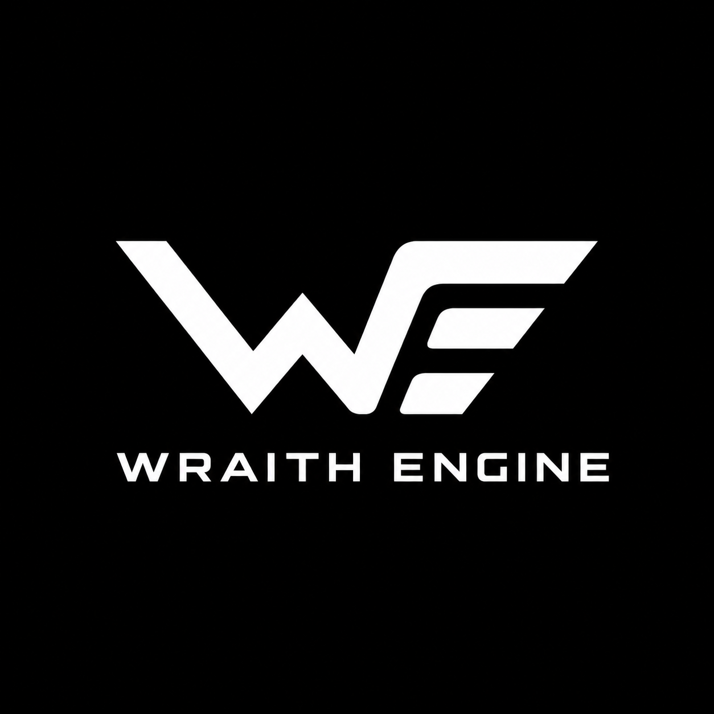
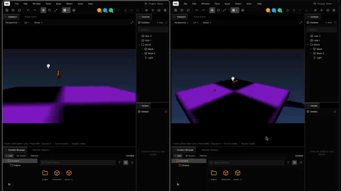

<div align="center">
  
  <h1>Wraith Engine</h1>
  <p>A distributed game engine with a browser-based collaborative editor</p>
</div>

---



## Overview

Wraith Engine is a C++/Vulkan game engine runtime paired with a browser-based editor shell. The engine runs headless on a server, streams rendered viewports to browser clients via WebRTC with H.264, and processes editing commands through an authoritative command/event model. One shared runtime supports both local native editing and remotely hosted collaborative sessions.

Collaborative simulation is session-wide: when the simulation host presses `Play`, `Pause`, or `Stop`, every connected collaborator sees the same runtime state. In the current model, the first connected browser collaborator becomes the simulation host for that session, while the headless renderer keeps its reserved local render user.

The browser-facing transport is now encapsulated behind a dedicated `WraithNetworking` engine module. That module owns HTTP and WebSocket serving through vendored `uWebSockets`, while the existing WebRTC session path remains intact as the protected media/control layer used for streamed viewports.

The engine's platform boundary now lives under a foundational `HAL/` layer. OS, hardware, and compiler-specific functionality routes through `AxiomHAL`, and higher-level engine modules no longer include platform headers or call platform APIs directly.

## Architecture

```
Browser (React / Next.js)
  ├─ Editor UI  (outliner, inspector, toolbar, content browser)
  └─ WebRTC Viewport Client
          ↕  commands  /  H.264 video
AxiomRemoteViewportServer  (C++)
  └─ EditorSession  (authoritative scene state)
          ├─ Vulkan Renderer  (offscreen, per-client)
          └─ ScriptHost  (Coral .NET 9 / C# scripting)

AxiomCore runtime flow
  ├─ HAL  (`AxiomHAL`: platform, dylib, sockets, file watch, SVG, media backends)
  └─ ModuleManager  (register / enable / disable / query modules)
          ├─ Application modules  (window polling, layer update, layer render, renderer frame)
          ├─ Host modules  (session transport, script host lifecycle, networking)
          ├─ Editor feature modules  (viewport input, selection, scene render)
          ├─ Headless overlay module  (billboards, colliders, presence, gizmo overlay state)
          └─ EditorSession managers  (command dispatch, scene-state coordination, physics lifecycle, validation)
```

## Features

**Engine**
- Vulkan rendering backend with MoltenVK on macOS
- Headless offscreen rendering with H.264 encoding (VideoToolbox on macOS)
- Vulkan backend split into focused subsystems: `VulkanResourceManager`, `VulkanPipelineLibrary`, and `VulkanDrawSubmissionSystem`, with `VulkanRendererBackend` acting as the coordinator
- Texture uploads now use an async transfer-queue path with semaphore synchronization instead of stalling the main thread with synchronous immediate-submit work
- Hot-path mesh submission path avoids per-frame RTTI and reuses persistent scratch buffers in the Vulkan scene renderer
- Authoritative command/event model for scene mutations
- Foundational engine module/plugin system with lifecycle-managed runtime modules and queryable active state
- Foundational `HAL/` platform layer with macOS implementations isolated under `HAL/MacOS/`
- `WraithNetworking` module for toggleable browser-facing transport, exposing initialization state plus connection metrics for future CVAR/config plumbing
- DataModel scene hierarchy — folders, meshes, lights, cameras, actors
- Transform gizmos (translate / scale / rotate) with server-side hit-testing
- Multi-client rendering: each connected user gets their own viewport
- WebRTC streaming to browser
- C# scripting via [Coral](https://github.com/StudioCherno/Coral) (.NET 9, hot reload, two trust tiers)
- Scene persistence — `scene.json` save/load across restarts
- Session-wide Play / Pause / Stop with authoritative edit-snapshot restore
- Runtime-only Jolt physics stepping with pause / resume support
- Physics runtime boot now consumes a lightweight `RuntimeSceneState` snapshot instead of depending on editor-only scene headers
- Default static box collision for imported mesh assets, with load-time migration for older meshes that had no authored physics yet
- Configurable sky background — a two-color vertical gradient (compute-shader blended) or an equirectangular HDR (`.hdr`) sampled from a world-space ray; HDR data is preserved end-to-end as float pixels through a v2 cooked `.wtex` so future image-based lighting can reuse the same asset
- Mesh GPU upload now releases CPU-side vertex/index arrays by default; callers can opt back in with `MeshCreateOptions::KeepCpuData` for the rare CPU-readback/debug workflows that still need them

**Browser editor**
- Dockable panels: outliner, details/property inspector, content browser, toolbar, Place Actors, script editor, remote viewport
- Window menu to show/hide any panel; panels can be tabbed or floated
- Scene outliner with drag-drop reparenting, inline rename, right-click context menus
- Object lifecycle: create, duplicate, delete
- Per-client gizmo mode (Q / E / R shortcuts)
- Drag meshes into the remote viewport to add them directly
- Light icons render as color-tinted billboards and are selectable from the remote viewport
- User presence and camera visualization
- Script class attachment and hot-reload button
- Inspector-driven physics authoring: body type, collider type, extents/radius, mass, friction, bounce
- Read-only physics visibility for generated mesh children, with inheritance hints pointing back to the authored root mesh object
- World Details panel for editing the skybox: color pickers for the gradient mode, plus an HDR file slot that accepts drag-drop from the content browser, a searchable folder-icon picker listing every `.hdr` in the project, or a typed content-relative path
- Perspective / Orthographic viewport projection toggle; HDR skybox automatically falls back to gradient in orthographic mode
- Place Actors panel: searchable, category-filtered panel with click-to-place and drag-to-viewport placement; shapes (Cube, Sphere, Cylinder, Cone, Plane) place a Mesh child inside an Actor wrapper; lights, cameras, and generic actors each place their appropriate type

**Runtime architecture**
- `IModule` / `ModuleManager` foundation for engine-owned feature registration, initialization, update, shutdown, active-state toggling, and future CVAR/config integration
- `AxiomHAL` now acts as the base platform dependency for `AxiomCore`, which then feeds editor and headless modules
- `Application` loop now executes module phases instead of hardcoding subsystem updates
- Core app flow, headless host flow, editor viewport flow, and headless overlay rendering are split into focused modules instead of living in monolithic layer/application classes
- Browser-facing networking is now routed through the standalone `WraithNetworking` module instead of being bootstrapped inline by `AxiomRemoteViewportServer`
- `WraithNetworking` uses vendored `uWebSockets` for HTTP/WebSocket transport while preserving the existing WebRTC communication layer inside the module boundary
- First-party OS-specific functionality is now isolated under `HAL/`: platform detection, Vulkan loader fallback/dynamic library access, socket helpers, script file watching, SVG rasterization, VideoToolbox H.264, and macOS WebRTC
- `EditorSession` is now a lightweight coordinator that delegates command routing to `EditorCommandDispatcher`, scene/tree/transform responsibilities to `EditorSceneStateManager`, physics lifecycle to `EditorPhysicsController`, and validation to `EditorSessionValidationModule`
- Physics is now isolated behind a runtime-only scene snapshot seam and controller boundary: editor-state extraction stays in the session subsystem, while `PhysicsWorld` consumes only transforms, collider shapes, and material indices
- Window minimization and Vulkan surface creation now live behind the `Window` / `RenderSurface` abstraction, so the Vulkan backend no longer owns a GLFW window pointer or directly queries GLFW iconification state
- Vulkan mesh teardown now routes through a standalone `GPUResourceQueue` instead of reaching into the renderer backend singleton during destruction
- The old 1,700+ line Vulkan renderer monolith is gone: resource lifetime, pipeline/layout caching, and draw/submission responsibilities now live in distinct renderer subsystems with narrower ownership boundaries

## Rendering Data Path Notes

- `MeshVertex` is now a compact 32-byte layout: `vec3 position`, `vec3 normal`, `vec2 uv`. This trims per-vertex CPU and GPU upload footprint from the previous 40-byte layout while still matching the renderer's Vulkan vertex-input stride.
- `RenderMeshSubmission` no longer stores a per-submission `std::string Name`. Diagnostic names now live in a separate debug-data registry so runtime submissions stay lean.
- The Vulkan scene renderer reuses persistent scratch vectors for candidate, opaque, translucent, and compute submission lists. `RenderScenePasses()` clears and reuses those buffers each frame instead of allocating fresh vectors in the hot loop.
- Mesh type resolution now happens when submissions are built or queued, so the per-frame render loop no longer performs `std::dynamic_pointer_cast<VulkanMesh>` for every submitted mesh.
- `VulkanRendererBackend` is now GLFW-agnostic for frame begin and presentation setup: minimized-state checks and Vulkan surface creation are forwarded through runtime abstractions instead of hardcoded OS-library calls.
- `VulkanMesh` destruction no longer depends on `VulkanRendererBackend::TryGet()`. GPU buffer teardown is deferred through a shared `GPUResourceQueue`, which keeps resource lifetime independent from the backend singleton.
- Renderer responsibilities are now partitioned explicitly: `VulkanResourceManager` owns swapchain/images/buffers/descriptor-backed lifetime, `VulkanPipelineLibrary` owns raw Vulkan pipeline and layout caching, and `VulkanDrawSubmissionSystem` owns command recording, queue submission, offscreen capture publication, and async transfer synchronization.
- Async texture upload now routes through the transfer queue and a timeline-semaphore wait on graphics submission. This preserves the old rendered output while removing the main-thread stall from material and HDR texture uploads.
- Cooked mesh loading remains backward-compatible with older `.wmesh` payloads, but newly cooked assets use the current packed vertex layout.

## Renderer Validation

- `VulkanRendererBackend.cpp` was reduced from the previous 1,789-line monolith to a thin coordinator layer.
- A clean pre-refactor headless baseline and the refactored headless build both rendered the startup scene successfully.
- The first true captured startup-scene frame from baseline and refactor matched byte-for-byte in headless validation, confirming the subsystem split preserved rendered output.

## Prerequisites

- CMake 3.10+
- Ninja (recommended; `brew install ninja`)
- C++20 compiler (Clang recommended; Apple Clang 15+ on macOS)
- Vulkan SDK / MoltenVK (macOS: `brew install --cask vulkan-sdk`)
- Node.js 18+ and [pnpm](https://pnpm.io)
- macOS: Xcode command-line tools (required for VideoToolbox / WebRTC)

**Optional, required only when the corresponding CMake flag is ON:**

| Feature | Requirement |
|---------|-------------|
| C# Scripting (`AXIOM_ENABLE_SCRIPTING`) | .NET 9 SDK (`brew install dotnet`) |
| WebRTC transport (`AXIOM_ENABLE_WEBRTC`) | Pre-built `WebRTC.framework` or `libwebrtc` for macOS |

---

## Build

### Quick start (minimal — no scripting, no WebRTC)

```bash
cmake --preset debug
cmake --build build/debug
```

### With physics enabled

Physics uses Jolt and is currently enabled by default, but this is the explicit build if you want to guarantee it is on:

```bash
cmake --preset debug -DAXIOM_ENABLE_PHYSICS=ON
cmake --build build/debug
```

To build tests against the physics-enabled runtime:

```bash
cmake --preset debug -DBUILD_TESTING=ON -DAXIOM_ENABLE_PHYSICS=ON
cmake --build build/debug
ctest --test-dir build/debug
```

### With C# scripting enabled

Build the managed assemblies first, then configure with the scripting flag:

```bash
# 1. Build Coral's managed runtime shim
dotnet build ThirdParty/Coral/Coral.Managed/Coral.Managed-Static.csproj -c Debug

# 2. Build the engine API assembly
dotnet build Scripting/WraithEngine.Managed/WraithEngine.Managed.csproj -c Debug

# 3. Configure and build
cmake --preset debug -DAXIOM_ENABLE_SCRIPTING=ON
cmake --build build/debug
```

### With scripting + automatic hot reload (macOS only)

The HAL file watcher uses a macOS `kqueue` backend to detect `.dll` changes and reload without restarting the server:

```bash
cmake --preset debug \
  -DAXIOM_ENABLE_SCRIPTING=ON \
  -DAXIOM_SCRIPTING_WATCH=ON
cmake --build build/debug
```

### With WebRTC transport

Supply paths to a locally built WebRTC library or pre-built framework:

```bash
# Using a pre-built WebRTC.framework (macOS)
cmake --preset debug \
  -DAXIOM_ENABLE_WEBRTC=ON \
  -DAXIOM_WEBRTC_FRAMEWORK_PATH=/path/to/WebRTC.framework

# Using a static libwebrtc binary
cmake --preset debug \
  -DAXIOM_ENABLE_WEBRTC=ON \
  -DAXIOM_WEBRTC_LIBRARY_PATH=/path/to/libwebrtc.a \
  -DAXIOM_WEBRTC_INCLUDE_DIR=/path/to/webrtc/include
```

Note: the headless browser-facing server now uses vendored `uWebSockets` for HTTP/WebSocket handling and does not require a separate external HTTP/WebSocket library configuration step.

### With tests

```bash
cmake --preset debug -DBUILD_TESTING=ON
cmake --build build/debug
ctest --test-dir build/debug
```

To include the scripting tests:

```bash
dotnet build ThirdParty/Coral/Coral.Managed/Coral.Managed-Static.csproj -c Debug
dotnet build Scripting/WraithEngine.Managed/WraithEngine.Managed.csproj -c Debug
dotnet build Tests/TestScripts/WraithTestScripts/WraithTestScripts.csproj -c Debug
dotnet build Tests/TestScripts/WraithRestrictedScript/WraithRestrictedScript.csproj -c Debug

cmake --preset debug -DBUILD_TESTING=ON -DAXIOM_ENABLE_SCRIPTING=ON
cmake --build build/debug
ctest --test-dir build/debug
```

### Release build

All flags above work with the `release` preset:

```bash
cmake --preset release -DAXIOM_ENABLE_SCRIPTING=ON
cmake --build build/release
```

---

## CMake Options Reference

| Option | Type | Default | Description |
|--------|------|---------|-------------|
| `BUILD_TESTING` | `BOOL` | `OFF` | Build the Google Test suite |
| `AXIOM_ENABLE_SCRIPTING` | `BOOL` | `OFF` | Enable the Coral C# scripting host (.NET 9) |
| `AXIOM_SCRIPTING_WATCH` | `BOOL` | `OFF` | Auto-reload user scripts on disk change through the HAL file-watcher layer (current macOS backend uses `kqueue`). Requires `AXIOM_ENABLE_SCRIPTING=ON` |
| `AXIOM_SCRIPTING_TRUST_DEFAULT` | `STRING` | `Restricted` | Default sandbox tier for user scripts. `Restricted` (hosted — blocks `System.Net.*`, `System.Reflection.Emit`, etc.) or `Trusted` (local dev — full BCL access) |
| `AXIOM_ENABLE_WEBRTC` | `BOOL` | `OFF` | Enable the macOS WebRTC transport |
| `AXIOM_ENABLE_PHYSICS` | `BOOL` | `ON` | Enable the JoltPhysics runtime simulation seam |
| `AXIOM_WEBRTC_FRAMEWORK_PATH` | `PATH` | _(empty)_ | Path to a `WebRTC.framework` bundle (macOS framework variant) |
| `AXIOM_WEBRTC_LIBRARY_PATH` | `FILEPATH` | _(empty)_ | Path to a `libwebrtc` static/shared binary (non-framework variant) |
| `AXIOM_WEBRTC_INCLUDE_DIR` | `PATH` | _(empty)_ | Include directory for the non-framework libwebrtc variant |

**Trust profiles** — applies only when `AXIOM_ENABLE_SCRIPTING=ON`:

| Profile | Intended use | What it blocks |
|---------|-------------|----------------|
| `Restricted` | Hosted / cloud sessions | `System.Net.*`, `System.Net.Sockets`, `System.Reflection.Emit`, `System.Diagnostics.Process`, dynamic assembly loading |
| `Trusted` | Local dev, native editor | Nothing — full BCL available |

---

## Running

### Remote viewport server

```bash
./build/debug/Headless/AxiomRemoteViewportServer \
  --host 127.0.0.1 --port 8080 --width 1280 --height 720
```

At startup, `AxiomRemoteViewportServer` registers the toggleable `WraithNetworking` module with `ModuleManager`. That module owns transport initialization, publishes connection metrics/state snapshots, and keeps the existing WebRTC session logic active behind the same public server API.

### Browser editor

```bash
cd EditorFrontend
pnpm install
NEXT_PUBLIC_AXIOM_SERVER_ORIGIN=http://127.0.0.1:8080 pnpm dev
```

### Packaged runtime

`Package Project` now produces a cooked-only package under a project's `Package/`
directory. The staged layout is:

```text
Package/
  AxiomPackagedRuntime
  package.wraith.json
  Content/
    Cooked/
      scene.wscene
      AssetCookManifest.json
      ...
    Engine/
      ...
```

Packages do not ship `Content/scene.json` or project source assets. The packaged
runtime expects `package.wraith.json`, `Content/Cooked/scene.wscene`, the cooked
asset manifest, and all referenced cooked assets to be present.

To run a staged package directly:

```bash
./Projects/<project-slug>/Package/AxiomPackagedRuntime
```

To test the packaged runtime binary built in `build/` against an existing staged
package:

```bash
./build/debug/Headless/AxiomPackagedRuntime \
  --package-root /absolute/path/to/Projects/<project-slug>/Package
```

Open `http://localhost:3000` in your browser.

### Local native editor (no browser required)

```bash
./build/debug/Editor/AxiomEditor
```

---

## Project Structure

| Path | Contents |
|------|----------|
| `Axiom/` | Engine library — core, session, renderer, remote transport, scripting host |
| `HAL/` | Foundational platform abstraction layer plus concrete macOS implementations |
| `Editor/` | Native GLFW + ImGui editor executable |
| `Headless/` | Headless runtime and `AxiomRemoteViewportServer` |
| `Scripting/WraithEngine.Managed/` | C# engine API assembly (`Script`, `GameObject`, `Transform`) |
| `EditorFrontend/` | React / Next.js browser editor shell |
| `Content/` | Shaders, demo assets (`.glb`), and the persistent `scene.json` |
| `Content/Engine/` | Engine-bundled assets (billboards, primitive shapes); paths prefixed with `Engine/` resolve here |
| `Content/Engine/Primitives/` | Procedurally generated primitive meshes: Cube, Sphere, Cylinder, Cone, Plane |
| `Tools/` | Dev utilities — `gen_primitives.py` regenerates the primitive GLB assets |
| `Tests/` | Google Test suite |
| `Tests/TestScripts/` | C# test assemblies for scripting tests |
| `Docs/` | Architecture and design documents |
| `ThirdParty/` | Vendored dependencies (Coral, spdlog, glfw, fastgltf, glm, …) |
| `cmake/` | CMake helper modules |

---

## Tech Stack

| Layer | Technology |
|-------|------------|
| Engine | C++20, CMake, Vulkan |
| Windowing | GLFW, MoltenVK |
| Asset loading | fastgltf (glTF / glb) |
| Streaming | WebRTC, H.264 (VideoToolbox) |
| Scripting | [Coral](https://github.com/StudioCherno/Coral) — C++ ↔ .NET 9 host bridge |
| Managed scripting API | C# (.NET 9), `WraithEngine.Managed` |
| Browser editor | React 19, Next.js, TypeScript |
| Styling | Tailwind CSS, Radix UI |
| Testing | Google Test |
| Logging | spdlog |

---

## License

MIT — see [LICENSE](LICENSE).
