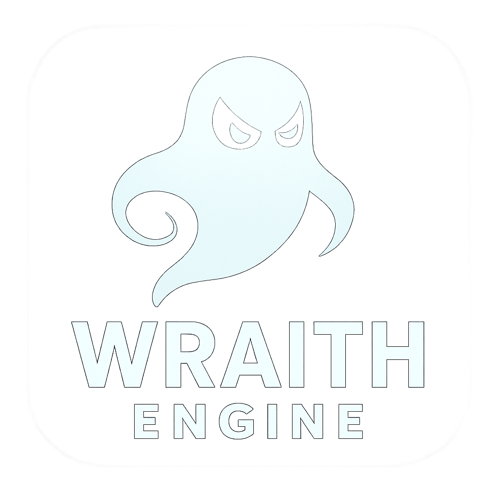
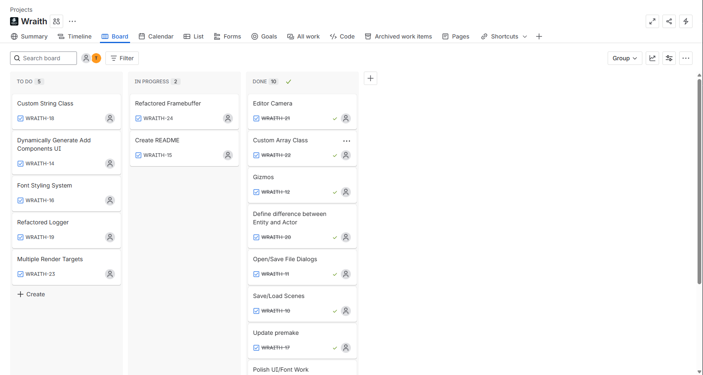

# Wraith Engine ⚔️



Wraith Engine is a C++ / OpenGL–based game engine inspired by **Unreal Engine**, **Hazel**, and concepts explored through various math and physics resources. The project is built with **C++**, leverages **OpenGL** for rendering (with plans for Vulkan support), and uses **Premake** for build automation.

---

## ✨ Current Features

* 🎥 **Editor Camera Controls**

  * Movement: `W`, `A`, `S`, `D`, `Space`, `Left Shift`
  * Panning: Middle Mouse Button
  * Rotation: Right Mouse Button
  * Zoom: Scroll Wheel

* 🖼️ **Rendering & Graphics**

  * OpenGL rendering pipeline
  * Real-time scene rendering
  * 2D texture support
  * Gizmos for transformations
  * Dynamic lighting & basic shading

* 🛠️ **Scene & Entity Management**

  * Scene customization and persistence
  * Dynamic entity creation & deletion
  * Component-based entity system (ECS)
  * Serialization & deserialization of scenes

* 🧩 **Engine Architecture**

  * Modular core engine separated from editor
  * Public **Wraith API** for game development
  * Native scripting support
  * Clean and organized folder structure
  * Premake build automation

* 🎨 **User Interface**

  * Integrated editor UI with **ImGui**
  * Inspector for entity components
  * Scene hierarchy panel

* 📊 **Project Management**

  * Developed using **Kanban methodology** in JIRA
  * Clear workflow for ongoing tasks and milestones

---

## 🚀 Planned Features / Roadmap

Wraith Engine is under active development, with the following features planned for future releases:

* 🔥 **Rendering Enhancements**

  * Vulkan backend for next-gen rendering
  * 3D mesh support (models, animations)
  * Advanced lighting (PBR, HDR, shadows)
  * Post-processing effects (bloom, SSAO, tone mapping)

* 🎮 **Gameplay Systems**

  * Event and messaging system for entities
  * Prefab system for reusable entity setups

* ⚡ **Physics & Simulation**

  * Physics integration (rigidbodies, collisions, triggers)
  * 2D & 3D physics simulation
  * Particle system

* 🌐 **Networking**

  * Client/server architecture
  * Multiplayer synchronization
  * Basic networked entity replication

* 🎵 **Audio**

  * Sound engine integration
  * Spatial audio support
  * Music streaming and effects

* 🌍 **Platform Support**

  * Linux and macOS support
  * Cross-platform builds with Premake
  * Potential console support in the long term

* 🛡️ **Developer Experience**

  * Built-in asset importer (textures, models, audio)
  * Hot-reloading for faster iteration
  * In-editor debugging tools

---

## 🏗️ Building Wraith Engine

Follow the steps below to clone and build Wraith Engine on **Windows**.

### Prerequisites

* [GitHub Desktop](https://desktop.github.com/) or [Git](https://git-scm.com/)
* [Visual Studio 2022](https://visualstudio.microsoft.com/) (Community Edition supported, v17.8+ recommended)

### Steps

1. **Clone the Repository**

   * Using GitHub Desktop: Fork and clone this repository.
   * Using Git CLI:

     ```bash
     git clone https://github.com/YourUsername/WraithEngine.git
     ```
   * Alternatively, download the source as a `.zip` and extract it. (Be sure to **Unblock** the file in its **Properties** before extracting if downloaded on Windows.)

2. **Run Setup Script**

   * Navigate to the `scripts/` folder.
   * Run `Setup.bat`.
   * This will:

     * Download engine binaries
     * Install required dependencies
     * Generate Visual Studio solution files

3. **Open in Visual Studio**

   * Open `WraithEngine.sln`.
   * Set **Configuration** to `Dist` and **Platform** to `x64`.

4. **Build the Editor**

   * Right-click **Wraith-Editor** → **Build**.

5. **Run the Engine**

   * Set **Wraith-Editor** as the startup project.
   * Press `F5` to launch the editor.

---

## 📌 Project Management

This project is actively maintained using **Kanban methodology** in **JIRA**, ensuring a structured workflow and clear task tracking.




---